# C4EAI 智能体项目 — 全架构说明文档

> 版本：v1.0 ｜ 适用代码基线：当前工作区
> 本文档说明**前后端函数的调用传递、各功能实现所用函数、功能前后端如何协作**，配流程图。

---

## 目录
1. [总体架构](#总体架构)
2. [前端技术栈与文件职责](#前端)
3. [后端技术栈与文件职责](#后端)
4. [前后端通信总览（API 端点全表）](#api端点)
5. [核心链路：对话（Agent 主循环）](#对话链路)
6. [附件/文件上传与解析](#文件链路)
7. [图片多模态](#图片链路)
8. [继续生成（同框续写）](#续写链路)
9. [停止生成](#停止链路)
10. [工具系统](#工具系统)
11. [图谱 (Neo4j) 查询](#图谱链路)
12. [智能体配置与技能](#配置链路)

---

<a name="总体架构"></a>
## 1. 总体架构

纯前端 SPA（静态 HTML/JS/CSS）+ 独立 FastAPI 后端。前端负责交互与渲染，后端负责 Agent 推理、文件解析、图谱/知识库访问。

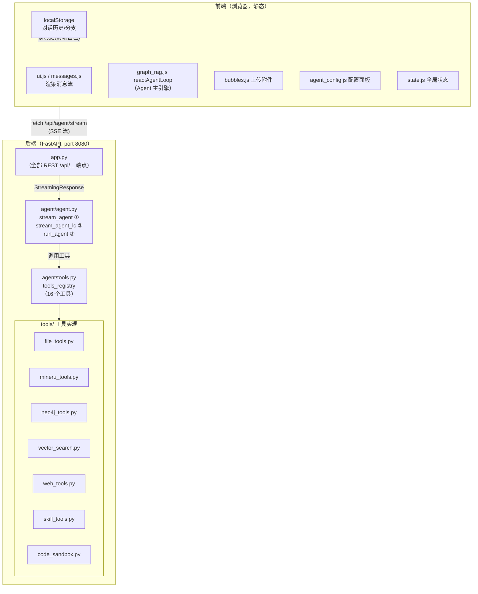

**数据流总览（一次完整对话）**：

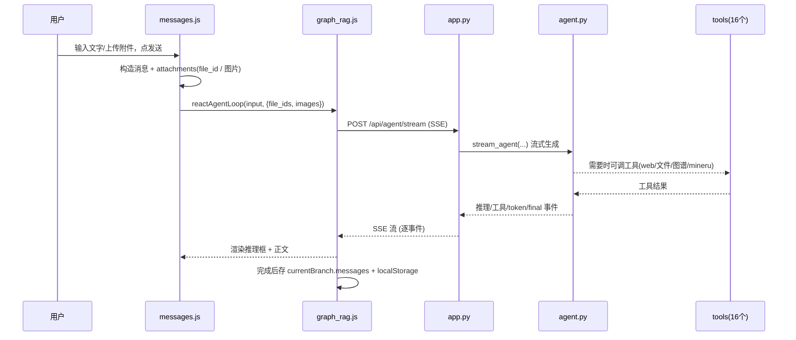

返回：[目录](#目录)

---

<a name="前端"></a>
## 2. 前端技术栈与文件职责

| 文件 | 作用 | 核心函数 |
|---|---|---|
| `state.js` | 全局状态（settings/models/branches/agentConfig） | `state` 对象、`saveBranches()`、`loadBranches()` |
| `dom.js` | DOM 元素引用 + 按钮状态 | `sendBtn`、`updateSendButtonState()`、各元素 const |
| `settings.js` | 模型/供应商配置 | `rebuildModelConfig()`、`getModelBaseUrl()` |
| `api.js` | API/历史/续写入口 | `init()`、`createNewConversation()`、`continueGeneration()`、`stopGeneration()` |
| `messages.js` | 消息渲染 + 发送 + 附件 | `sendMessage()`、`createMessageElement()`、`addMessage()`、`editMessage()`、`removeAttachmentFromMessage()`、`formatMessage()`、`getRecentMessagesForContext()` |
| `editing.js` | 编辑浮窗 | `floatingEditor`、`updateMessageElContent()` |
| `formatting.js` | markdown → HTML 渲染 | `formatMessage()`(图片预处理) |
| `graph_rag.js` | **Agent 主引擎** | `reactAgentLoop()` |
| `bubbles.js` | 上传面板 | `_autoProcessAttachment()`、`addPendingAttachment()` |
| `bubble_actions.js` | 本地文件解析(仅 OCR) | `extractTextFromFile()`、`fileToBase64()`、`imageToTextOCR()` |
| `image_tools.js` | 图片内联编辑 | `attachInline()`、`uploadBlob()` |
| `sidebar.js` | 侧栏/分支/笔记 | `renderMessages()`、笔记 CRUD |
| `branching.js` | 分支管理/设置加载 | 对话分支逻辑 |
| `agent_config.js` | 智能体配置面板 | `initAgentConfigPanel()`、工具勾选读写 |
| `provider.js` | 供应商选择 | 供应商切换 |
| `tools.js` | token 计数器 | `updateTokenDisplay()` |
| `database.js` | 本地向量/知识检索 | `updateTokenDisplay`等 |
| `skill_system.js` | 技能管理 | 技能加载 |
| `agent_tools.js` | 工具结果处理 | 工具展示辅助 |
| `ui.js` | UI 渲染/按钮 | `renderMessages()`、`updateSendButtonState()` |
| `utils.js` | 通用工具 | 格式化/日期等 |

返回：[目录](#目录)

---

<a name="后端"></a>
## 3. 后端技术栈与文件职责

| 文件 | 作用 | 核心函数/端点 |
|---|---|---|
| `app.py` | **FastAPI 应用 + 全部 REST 端点** | 见 [API 端点全表](#api端点) |
| `agent/agent.py` | **Agent 三引擎 + 系统提示词 + 停止令牌** | `stream_agent`(custom) / `stream_agent_lc`(langchain) / `run_agent` / `_build_system_prompt` / `_build_context` / `cancel_active_generation` |
| `agent/tools.py` | **工具注册表**（把 16 个后端函数包装成 LLM 可调用工具） | `tools_registry`、`_make_async_tool` |
| `tools/file_tools.py` | 文件上传/解析/读取/图片 base64 | `upload_file`(pdf/docx/xlsx/pptx/odt/图片解析)、`read_file`(支持 file_id)、`image_to_base64`、`get_file_text`、`delete_upload`、笔记 CRUD |
| `tools/mineru_tools.py` | MinerU v4 批量 PDF→Markdown | `parse_pdfs`、`load_token`、`save_token` |
| `tools/neo4j_tools.py` | Neo4j 图谱 | `Neo4jClient`、`connect`、`schema`、`cypher` |
| `tools/vector_search.py` | 历史/知识库向量检索 | `search_history`、`search_knowledge` |
| `tools/web_tools.py` | 联网搜索/抓取 | `web_search`、`web_extract` |
| `tools/skill_tools.py` | 技能读写 | `skill_list`、`skill_view`、`skill_write` |
| `tools/code_sandbox.py` | Python 代码执行 | `run_python`(Pyodide/子进程) |

返回：[目录](#目录)

---

<a name="api端点"></a>
## 4. 前后端通信总览（API 端点全表）

> 前端通过 `fetch(BACKEND_API_URL + 路径, ...)` 调用。`BACKEND_API_URL` 定义在 `graph_rag.js`，通常为 `http://127.0.0.1:8080`。

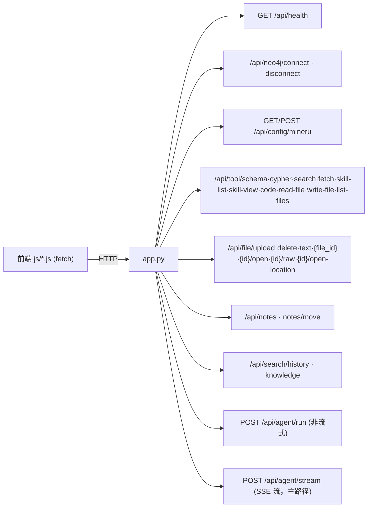

| 端点 | 方法 | 前端调用方 | 用途 |
|---|---|---|---|
| `/api/health` | GET | 启动自检 | 健康检查 |
| `/api/neo4j/connect` | POST | 配置面板 | 连接图谱 |
| `/api/neo4j/disconnect` | POST | 配置面板 | 断开图谱 |
| `/api/config/mineru` | GET/POST | `agent_config.js` | 读/存 MinerU token |
| `/api/tool/schema/*` | POST | `agent_tools.js` | 直调图谱 schema |
| `/api/tool/cypher` | POST | 图谱查询 | 执行 Cypher |
| `/api/tool/search` | POST | 知识检索 | 搜索知识库 |
| `/api/tool/fetch` | POST | 网抓 | 抓网页 |
| `/api/tool/code` | POST | run_code | 执行代码 |
| `/api/tool/read-file` | POST | read_file | 读文件 |
| `/api/file/upload` | POST | `bubbles.js` | 上传 → file_id |
| `/api/file/delete` | POST | `messages.js` | 删除附件 |
| `/api/file/{file_id}` | GET | 附件预览 | 取文件字节 |
| `/api/file/{file_id}/raw` | GET | 下载原文件 | 取原始字节 |
| `/api/notes*` | 多 | `sidebar.js` | 笔记 CRUD |
| `/api/search/history` | POST | agent | 搜历史 |
| `/api/agent/run` | POST | (备用) | 非流式单次 |
| `/api/agent/stream` | POST | **`reactAgentLoop`** | **SSE 流式 Agent（主路径）** |

返回：[目录](#目录)

---

<a name="对话链路"></a>
## 5. 核心链路：对话（Agent 主循环）

**前端**：`messages.js:sendMessage()` → `graph_rag.js:reactAgentLoop()` → SSE 流 → 渲染。

**后端**：`app.py:/api/agent/stream` → `stream_agent`(custom) 或 `stream_agent_lc`(langchain) → LLM + 工具循环 → 事件流。

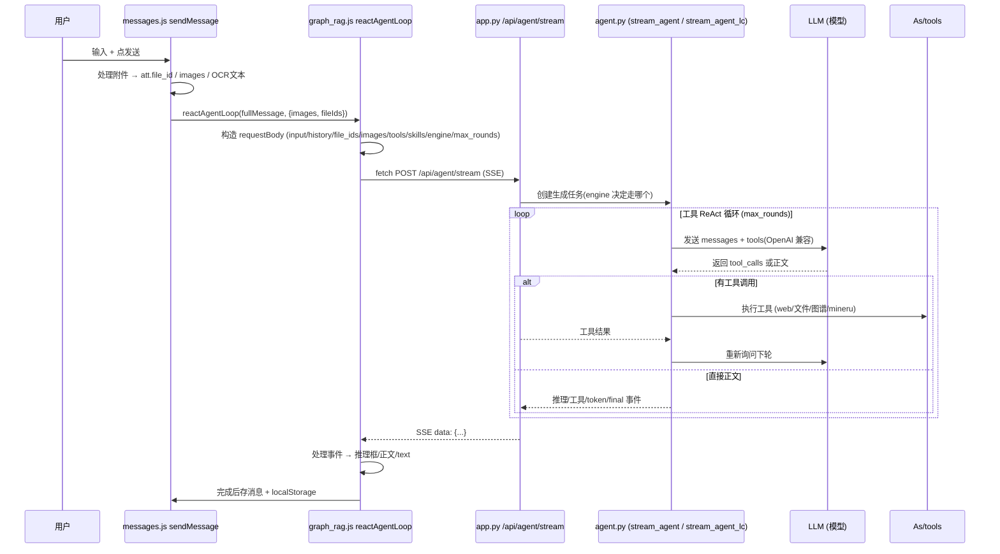

**请求体字段（`reactAgentLoop` 构造，见 `graph_rag.js`）**：
```jsonc
{
  input: "用户文字+附件标记",
  history: [...],             // 前端历史（续写时保留完整）
  enabled_tools: [...],       // 16 选中工具
  loaded_skills: [...],
  neo4j_config: {...},
  model: { model, api_key, base_url, temperature },
  context_length: 10,
  branch_id: "...",
  permission_mode: "safe|ask|full",
  engine: "custom|langchain", // 选 ① 或 ② 引擎
  max_rounds: 8,
  file_ids: [...],            // 附件 id
  images: [...]               // base64 图片(多模态)
}
```

返回：[目录](#目录)

---

<a name="文件链路"></a>
## 6. 附件/文件上传与解析（Hermes 式：只存 file_id）

文件**全后端解析**，前端只在消息里存 `file_id`（不存内容）。首次上传自动解析；多轮由后端按 file_id 自动注入。

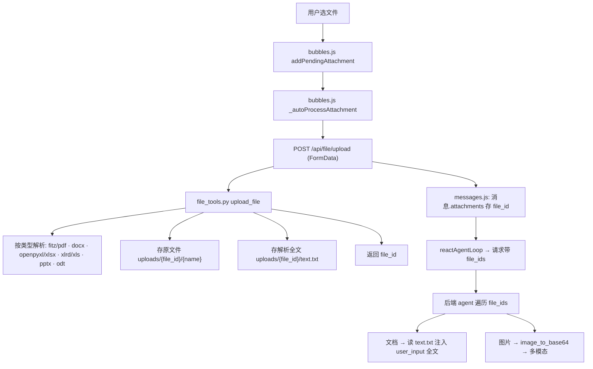

**前端关键**：`_autoProcessAttachment()`（`bubbles.js`）上传后，附件文本仅存 `file_id`（PDF/Office 不本地提取；**仅图片 OCR 保留前端**）。

**后端关键**：`upload_file()`（`file_tools.py`）按扩展名分派解析器，产出 `text.txt`。

| 类型 | 解析库 | text.txt 内容 |
|---|---|---|
| `.pdf` | fitz | 全文 |
| `.docx` | python-docx | 段落文本 |
| `.xlsx` | openpyxl | 表格文本 |
| `.xls` | xlrd(新装) | 表格文本 |
| `.pptx` | python-pptx | 幻灯片文本 |
| `.odt` | zip+xml | 段落 |
| `.txt/.md/.csv/json` | utf-8 | 全文 |
| `.doc` | — | 提示转 docx |
| 图片 | image_to_base64 | 占位 + 多模态 |

返回：[目录](#目录)

---

<a name="图片链路"></a>
## 7. 图片多模态

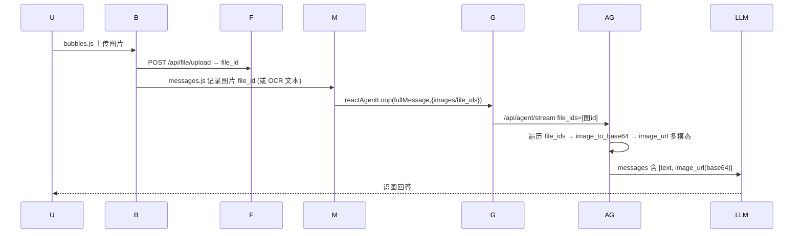

- **多模态模式**：图片 file_id → 后端 `image_to_base64()` → `image_url` 塞进 user 消息（千问支持多模态）。
- **OCR 模式（唯一前端例外）**：`bubble_actions.js:imageToTextOCR()`（Tesseract 前端）提取文字进 input。
- agent 后续要读历史图片：调 `read_file({file_id})` → 后端返回 base64。

返回：[目录](#目录)

---

<a name="续写链路"></a>
## 8. 继续生成（同框续写）

点击 assistant 消息旁的「继续生成」→ 在同一消息框内续写，思考过程也同框。

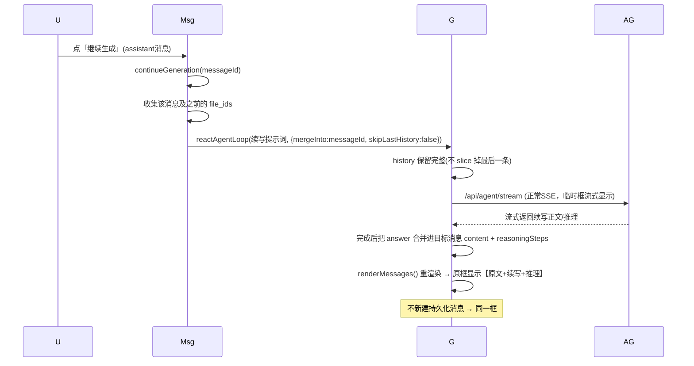

- `continueGeneration()`（`api.js`）→ 调 `reactAgentLoop`，传 `mergeInto: messageId` + `skipLastHistory: false`。
- `reactAgentLoop`（`graph_rag.js`）在 `mergeInto` 时：合并 `content` 与 `reasoningSteps` 进目标消息，再 `renderMessages()`。

返回：[目录](#目录)

---

<a name="停止链路"></a>
## 9. 停止生成

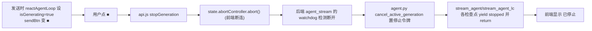

前端：`reactAgentLoop` 开头 `state.isGenerating=true; sendBtn=■`；`stopGeneration()`（`api.js`）abort。
后端：`app.py` `agent_stream` 起 watchdog（0.4s 轮询 `request.is_disconnected()`）→ `cancel_active_generation()`；`agent.py` 各循环/流中检查 `generation_cancelled()`。

返回：[目录](#目录)

---

<a name="工具系统"></a>
## 10. 工具系统（16 个工具）

后端注册于 `agent/tools.py` 的 `tools_registry`，前端通过 `agent_config.js` 配置面板勾选 `enabledTools` 传给后端，后端按 `enabled_tools` 过滤后把工具 schema 给 LLM。

| 工具 | 前端勾选id | 后端实现 | 用途 |
|---|---|---|---|
| `graph_schema` | tool-graph-schema | `neo4j_tools` | 获取图谱结构 |
| `execute_cypher` | tool-execute-cypher | `neo4j_tools` | 执行 Cypher |
| `skill_list` | tool-skill-list | `skill_tools` | 列技能 |
| `skill_view` | tool-skill-view | `skill_tools` | 读技能 |
| `web_search` | tool-web-search | `web_tools` | 联网搜索 |
| `web_extract` | tool-web-extract | `web_tools` | 抓网页 |
| `todo` | tool-todo | 内建 | 任务清单 |
| `conversation_notes` | tool-notes | `file_tools`(notes) | 对话笔记 |
| `run_code` | tool-run-code | `code_sandbox` | 执行 Python |
| `read_file` | tool-read-file | `file_tools` | 读文件/附件/图片base64 |
| `write_file` | tool-write-file | `file_tools` | 写文件 |
| `list_files` | tool-list-files | `file_tools` | 列目录 |
| `skill_write` | tool-skill-write | `skill_tools` | 自我改技能 |
| `search_history` | tool-search-history | `vector_search` | 搜历史 |
| `search_knowledge` | tool-search-knowledge | `vector_search` | 搜知识库 |
| `mineru_parse` | tool-mineru | `mineru_tools` | PDF→Markdown |

**传递**：前端勾选 → 存 localStorage(`agentConfig.enabledTools`) → 发送时随 `enabled_tools` 传后端 → `agent.py` 过滤 `tools_registry` → 生成 OpenAI tools schema → LLM 发起调用 → `_make_async_tool` 包装执行 → 结果回 LLM。

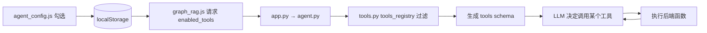

返回：[目录](#目录)

---

<a name="图谱链路"></a>
## 11. 图谱 (Neo4j) 查询

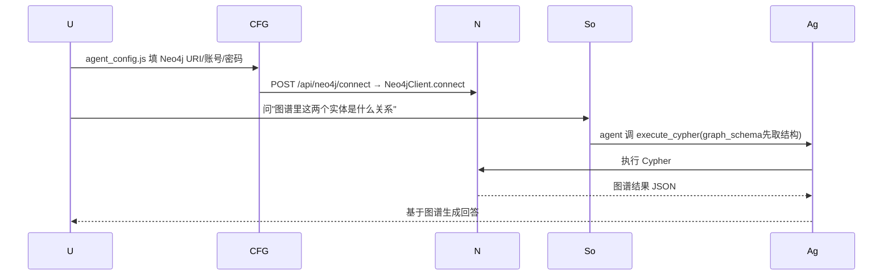

- 连接信息存 `state.neo4j`，前端直连或经后端 `/api/neo4j/connect`。
- agent 通过 `execute_cypher`/`graph_schema` 工具访问。

返回：[目录](#目录)

---

<a name="配置链路"></a>
## 12. 智能体配置与技能

**配置面板**（`agent_config.js:initAgentConfigPanel()`）管理：
- 引擎选择（custom = 手搓流式 / langchain）
- 权限模式（safe / ask / full）
- 工具勾选（`enabledTools`）
- 技能选择（`loadedSkills`，如 graph-guide）
- MinerU token（`/api/config/mineru`）
- Neo4j 连接

**技能**：`skill_system.js` + `skill_tools.py`。选中技能名随 `loaded_skills` 传后端，`_build_system_prompt()`（`agent.py`）读取技能描述注入系统提示词。（技能本体存 `skills/` 目录 + `skills/index.json`）。

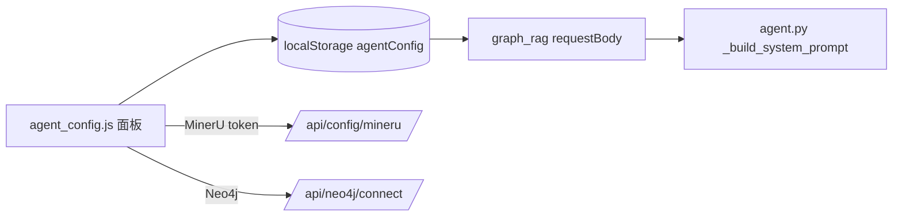

返回：[目录](#目录)

---

## 附：前端加载顺序（index.html）

脚本顺序即依赖顺序（先加载的提供全局 const/函数给后加载的）：
```
state → dom → settings → image_tools → api(续写/停止) → database → sidebar
→ branching → provider → messages(渲染/发送) → editing → formatting
→ tools → graph_rag(Agent主引擎) → agent_tools → skill_system
→ agent_config → ui → bubbles(上传) → bubble_actions(OCR) → utils → main
```
> 注意：`graph_rag.js`(Agent主引擎) 在 `ui.js` 之前，但运行时调用 `updateSendButtonState`/`renderMessages` 时两个脚本都已加载完，故安全。

---

*文档生成基于当前工作区代码（已含：全后端文件解析、图片多模态、Hermes 式附件 file_id、工具收敛 16 个、续写同框 mergeInto、停止按钮、删 CHAT 死代码）。*
